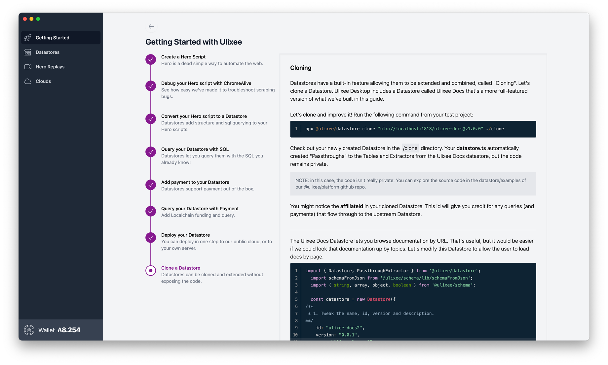

# Ulixee Desktop

Ulixee Desktop is an Electron-based desktop application that provides a suite of tools to help you:

- Develop and test web scraping scripts using the Hero browser engine.
- Manage and monitor your Datastores.
- Manage [Argon](https://argonprotocol.org) payments and profits.

## Download

The latest version of Ulixee Desktop can be downloaded from the [releases page](
  https://github.com/ulixee/desktop/releases/latest).


## Features

### Datastores

Query, manage, and monitor your Datastores. Datastores are a secure, encrypted, and distributed database that can be queried using SQL.

### Argon

Manage your Argon Localchain(s), connect to Databrokers and view your Datastore profits.

### Replay Hero Scripts

#### Timeline

View every "tick" of your script timeline (paint event, mouse movement, typing, page
load, etc).

#### True DOM

As your script replays, the DOM is reproduced exactly as it was during your script. If a
selector doesn't work, you can use the Console tab to run querySelectors and see what
went wrong.

#### Selector Generator

Automatically generate DOM selectors for elements. Internally creates 10k possible
selectors. COMING SOON: suggests fixes when a selector breaks.

#### Hero Script

Step through your Hero code as the browser updates. Each step includes the internal
arguments and results.

#### Resources

See all Hero resources, and show how Hero's man-in-the-middle corrects invalid headers.
Includes an ability to "Search" resource bodies to locate data files.

#### State Generator

Compare DOM changes at each step of the timeline. This can be used to figure out what
DOM changes to wait for in your code.

---

## Project Development Setup

### Install

```bash
$ yarn
```

### Development

If you are developing and want to link in Ulixee Platform or Hero, you should first clone those projects in adjacent directories and build each one.

Then, you can link them in using `yarn sync`. The built project files (`/build`) will be copied into `packages` and linked as workspaces.

You need to rebuild the dependencies at least once using the following command (if you have issues, look at the troubleshooting section below):

```bash
$ yarn build:deps
```

or

```bash
$ PYTHON=python3.10 yarn build:deps
```

```bash
$ yarn dev
```

### Build

```bash
# For windows
$ yarn build:win

# For macOS
$ yarn build:mac

# For Linux
$ yarn build:linux
```

### Troubleshooting

If you have a node-gyp issue, you likely need to align your python version with nodejs. For instance, a `distutils` error
means you need to downgrade to python <=3.10. You can do so by simply setting the `PYTHON` environment variable to the
path of the python executable. For example, `PYTHON=/usr/bin/python3.9 yarn install`.
